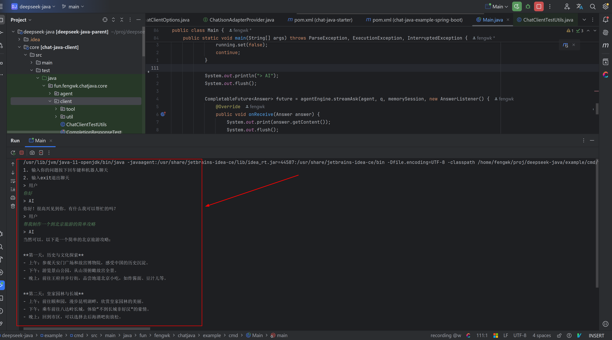

## Deepseek Java (Client)

提供 Deepseek Java Client，以及部分 high level 的 Agent 封装。

由于 Deepseek 兼容 ChatGPT 协议，所以理论上这也能作为一个 ChatGPT 客户端。

## Features

- Deepseek Java Client
- 提供了 Agent Memory 抽象，同时提供了一个 Agent Engine 用于执行多轮对话
- 提供了与 Spring Boot 集成
- 所有依赖都是可选项，应当能集成到大部分项目中
- 提供了一个简单的命令行问答工具示例

## Requires

- 因为使用了 JDK HttpClient 库，因此需要使用 JDK11 或以上版本
- 如需向下兼容可以使用 OkHttp 重新实现 ChatClient 接口
- 如果你要运行本项目的代码最好配置一下环境变量`CHAT_API_KEY`，因为默认从这里读取 API token

```shell
export CHAT_API_KEY=${YourToken}
```

## Usage

### Client

直接在使用客户端需要依赖 `chat-java-core` 以及任一 JSON 库：

- jackson
- gson
- fastjson
 
```xml
<dependencies>
    <dependency>
        <groupId>fun.fengwk.chat-java</groupId>
        <artifactId>chat-java-core</artifactId>
        <version>0.0.1</version>
    </dependency>
    <!-- 可以从下面的3个JSON库中任选一个依赖 -->
    <dependency>
        <groupId>com.fasterxml.jackson.core</groupId>
        <artifactId>jackson-databind</artifactId>
        <version>${yourVersion}</version>
    </dependency>
<!--    <dependency>-->
<!--        <groupId>com.google.code.gson</groupId>-->
<!--        <artifactId>gson</artifactId>-->
<!--        <version>${yourVersion}</version>-->
<!--    </dependency>-->
<!--    <dependency>-->
<!--        <groupId>com.alibaba</groupId>-->
<!--        <artifactId>fastjson</artifactId>-->
<!--        <version>${yourVersion}</version>-->
<!--    </dependency>-->
</dependencies>
```

日志框架使用了 slf4j，你需要有对应的实现，在example中使用了 slf4j-simple，一般来说使用你应用中默认日志框架的 slf4j 实现或桥接即可。

如果需要使用 ChatGPT token 计数需要依赖 `jtokkit`

```xml
<dependency>
    <groupId>com.knuddels</groupId>
    <artifactId>jtokkit</artifactId>
    <version>${yourVersion}</version>
</dependency>
```

接下来可以开始使用 ChatClient

```java
package fun.fengwk.chatjava.core.client;

import fun.fengwk.chatjava.core.client.request.ChatMessage;
import fun.fengwk.chatjava.core.client.request.ChatRequest;
import fun.fengwk.chatjava.core.client.util.json.ChatJsonUtils;

import java.util.Collections;
import java.util.concurrent.CompletableFuture;
import java.util.concurrent.ExecutionException;

/**
 * @author fengwk
 */
public class Main {

    public static void main(String[] args) throws ExecutionException, InterruptedException {
        DefaultChatClientProvider chatClientProvider = new DefaultChatClientProvider();
        ChatClient chatClient = chatClientProvider.getChatClient();

        ChatRequest chatRequest = new ChatRequest();
        chatRequest.setModel("deepseek-reasoner");
        chatRequest.setMessages(Collections.singletonList(ChatMessage.newUserMessage("你好呀")));

        // 普通模式
        System.out.println("chatCompletions-------------------------");
        ChatCompletionsResponse response = chatClient.chatCompletions(chatRequest);

        System.out.println("chatCompletions: " + ChatJsonUtils.toJson(response.getChatResponse()));

        // 流式模式
        System.out.println("streamChatCompletions-------------------------");
        CompletableFuture<ChatCompletionsResponse> future = chatClient.streamChatCompletions(
                chatRequest, new StreamChatListener() {
                    @Override
                    public void onReceive(ChatCompletionsResponse response) {
                        System.out.println("onReceive: " + ChatJsonUtils.toJson(response.getChatResponse()));
                    }

                    @Override
                    public void onError(Throwable throwable) {
                        System.err.println("onError: " + throwable);
                    }

                    @Override
                    public void onComplete() {
                        System.out.println("onComplete----------------------------");
                    }
                });

        response = future.get();
        System.out.println("complete: " + ChatJsonUtils.toJson(response.getChatResponse()));
    }

}
```

客户端配置 `ChatClientOptions` 中定义了默认一系列默认值，你可以重新设置他们

```java
@Data
public class ChatClientOptions {

    /**
     * 补全url
     */
    private URI chatCompletionsUrl = ChatUrls.DEEPSEEK_CHAT_COMPLETIONS;

    /**
     * deekseek token，默认使用环境变量CHAT_API_KEY
     */
    private String token = System.getenv("CHAT_API_KEY");

    /**
     * 每次请求超时
     */
    private Duration perHttpRequestTimeout = ChatHttpClientFactory.getDefaultTimeout();

    /**
     * 为了避免deepseek现有的function calling bug不断循环调用消耗token，需要设置一个循环调用的上限次数
     */
    private int maxFunctionCallTimes = 3;

}
```

### Agent

Agent 是对 ChatClient 的封装，通过 AgentEngine 可以简单地实现多伦对话，我在`example/cmd`中提供了一个简单的命令行对话实现：

[Main.java](../example/cmd/src/main/java/fun/fengwk/chatjava/example/cmd/Main.java)



### SpringBoot

提供了一个 Spring Boot Starter 来快速继承到 Spring Boot 工程中，你只需要依赖下面的配置：

```xml
<dependencies>
    <dependency>
        <groupId>fun.fengwk.chat-java</groupId>
        <artifactId>chat-java-starter</artifactId>
        <version>0.0.1</version>
    </dependency>
    <!-- 在一个完整的SpringBoot项目中通常已经包含了这3者之一的JSON库 -->
<!--    <dependency>-->
<!--        <groupId>com.fasterxml.jackson.core</groupId>-->
<!--        <artifactId>jackson-databind</artifactId>-->
<!--        <version>${yourVersion}</version>-->
<!--    </dependency>-->
<!--    <dependency>-->
<!--        <groupId>com.google.code.gson</groupId>-->
<!--        <artifactId>gson</artifactId>-->
<!--        <version>${yourVersion}</version>-->
<!--    </dependency>-->
<!--    <dependency>-->
<!--        <groupId>com.alibaba</groupId>-->
<!--        <artifactId>fastjson</artifactId>-->
<!--        <version>${yourVersion}</version>-->
<!--    </dependency>-->
</dependencies>
```

如果你的 SpringBoot 项目引用了其它的 JSON 库，同时不想要再引入预置的 3 个 JSON 库，可以通过实现 ChatJsonAdapterProvider 并将其加入 ServiceLoader 的 SPI 中引入项目自身的 JSON 库实现。

SpringBoot 的配置类是`ChatClientProperties`，你可以通过`chat.client`前缀的key来配置它们：

```java
@Data
@ConfigurationProperties("chat.client")
public class ChatClientProperties {

    /**
     * 代理配置列表，host:port格式
     */
    private List<ProxyBuilder> proxies = Collections.emptyList();

    /**
     * 连接超时
     */
    private Duration connectTimeout = Duration.ofSeconds(5);

    /**
     * 默认的客户端配置
     */
    private ChatClientOptions defaultChatClientOptions = new ChatClientOptions();

}
```